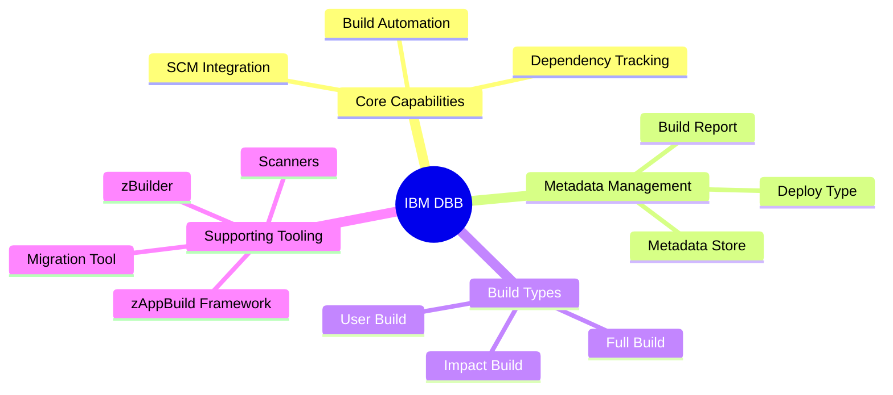

IBM Dependency Based Build (DBB) provides a comprehensive framework for modernizing mainframe build processes by integrating traditional z/OS applications into modern DevOps pipelines.

### Visualization of Key DBB Terms and Functions

### Explanations of Key Components

*   **IBM Dependency Based Build (DBB):** A stand-alone build solution for z/OS that uses modern scripting languages like Apache Groovy to automate the compilation and linkage of COBOL, PL/I, and Assembler applications.
*   **Metadata Store:** A repository (often using IBM Db2) that tracks the relationships between source files and produced binaries, allowing the system to understand the application structure.
*   **Scanners:** Tools provided by the DBB toolkit that analyze source files and load modules to identify dependencies (e.g., copybooks) and analyze object level relationships.
*   **Impact Build:** An intelligent build function that queries the Metadata Store to rebuild **only** the programs modified since a specific baseline and any files directly or indirectly impacted by those changes.
*   **User Build:** A developer-focused function in IDEs like **VS Code** or **IDz** that allows a user to build a single program for fast testing without committing changes to the central SCM.
*   **Build Report (`BuildReport.json`):** A JSON-formatted manifest generated at the end of a build that records all produced artifacts and metadata for use in packaging and deployment.
*   **Deploy Type:** A metadata attribute assigned to artifacts (e.g., **LOAD**, **DBRM**, **MAPLOAD**) within the build report that tells deployment tools like Wazi Deploy how to install the component.
*   **DBB Migration Tool:** A utility that facilitates moving source code from legacy PDS members to Git repositories on z/OS UNIX, handling necessary **code page conversion** between EBCDIC and UTF-8.
*   **zAppBuild and zBuilder:** Standardized frameworks built on DBB APIs; zAppBuild is a community-driven Groovy framework, while zBuilder is a YAML-based build tool introduced in DBB v3.0.

To think of it simply, **DBB** acts as the **intelligent foreman** of a digital construction site: it uses **Scanners** to read the blueprints, tracks all materials in its **Metadata Store**, and ensures that if a single brick (file) is updated, the **Impact Build** only touches the parts of the building that actually rely on that brick.

<html>
<body>
<!--StartFragment--><html><head></head><body>
On z/OS systems, programs generally interact using two primary methods: <strong>static calls</strong> and <strong>dynamic calls</strong>.

<h3><strong>Static Program Calls</strong></h3>
<ul>
<li><strong>Mechanism:</strong> Statically called programs are <strong>linked together at build time</strong> into a <strong>single executable load module</strong>.</li>
<li><strong>Build Complexity:</strong> This method requires that all dependencies are strictly tracked during the build process to ensure that the main program and its subprograms are correctly assembled.</li>
<li><strong>Maintenance:</strong> If a subprogram is modified, the build process must recognize the relationship, recompile the subprogram, and then <strong>rebind</strong> (re-link) the main program and the subprogram into a new load module.</li>
<li><strong>Runtime:</strong> Since all code is contained within one module, there is no need to search for subprograms in external libraries during execution.</li>
</ul>
<h3><strong>Dynamic Program Calls</strong></h3>
<ul>
<li><strong>Mechanism:</strong> In dynamic linking, the calling program and the subprograms remain <strong>totally separate</strong>. They are built and link-edited as independent entities.</li>
<li><strong>Build Complexity:</strong> This approach is favored by many organizations because it significantly <strong>reduces complexity at build time</strong>, as programs do not need to be physically bound together.</li>
<li><strong>Maintenance:</strong> While build complexity is lower, <strong>runtime dependencies</strong> must be carefully understood. If an interface change occurs that affects both the caller and the called program, both must be updated and coordinated.</li>
<li><strong>Runtime:</strong> The subprogram is not part of the main load module; instead, it is <strong>fetched from the library concatenation</strong> only when it is needed during execution.</li>
</ul>
<h3><strong>Summary Comparison</strong></h3>

Feature | Static Calls | Dynamic Calls
-- | -- | --
Packaging | Combined into one load module. | Separate load modules.
Build Timing | Assembly occurs at build time. | Linking resolved at runtime.
Dependency Tracking | Required during build/link-edit. | Required for runtime/subsystem coordination.
Complexity | High build-time complexity. | Reduced build-time complexity.
Flexibility | Requires rebind if subprogram changes. | Subprograms can be updated independently.

To understand the difference, imagine a <strong>static call</strong> as a <strong>printed book</strong> where every chapter is bound together at the factory; if you want to change one page, you have to re-bind the entire volume. A <strong>dynamic call</strong> is more like a <strong>digital playlist</strong> where the songs are stored separately; you can update or swap one song without having to re-download the entire list, provided the player knows where to find each file at the moment it needs to play.
</body></html><!--EndFragment-->
</body>
</html>
