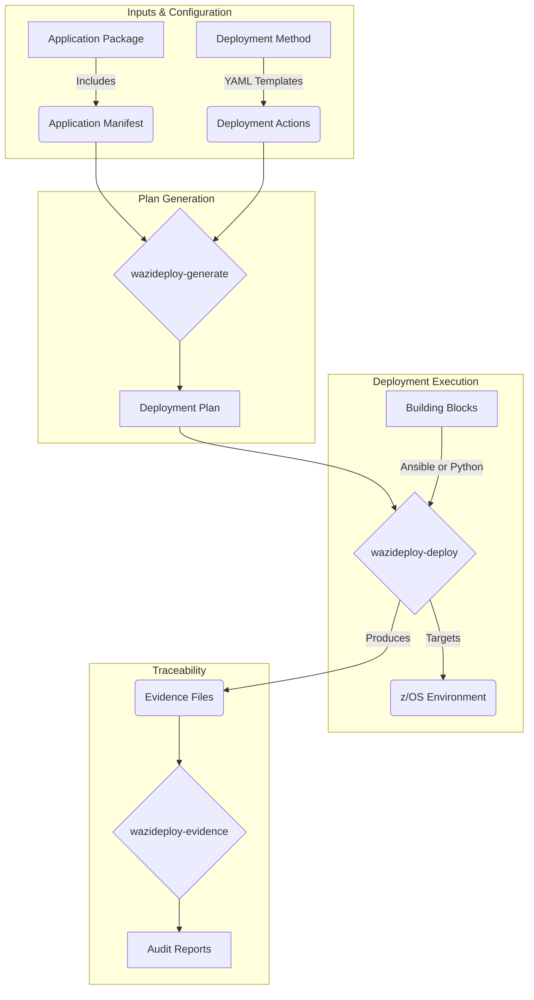

IBM Wazi Deploy is a command-line interface (CLI) tool designed to automate and accelerate the deployment of z/OS applications within a modern CI/CD pipeline.

### Visualization of IBM Wazi Deploy Functions

### Key Terms and Functions

*   **Application Manifest:** A file that lists and describes all components of an application version stored in an artifact repository. It acts as the "packing list" for the deployment.
*   **Deployment Method:** Declarative **YAML files** that describe the specific actions required to deploy various artifact types (e.g., CICS, Db2, or Batch). These methods can be customized and reused across different applications.
*   **Building Blocks:** Reusable components implemented as **Ansible modules or Python functions**. They perform the "heavy lifting" of deployment, such as copying members, performing **Db2 binds**, or executing **CICS NEWCOPY/PHASE-IN** commands.
*   **Deployment Plan:** A step-by-step sequence of actions generated by the `wazideploy-generate` command. It maps the specific artifacts in the manifest to the instructions in the deployment method.
*   **Conditional Deployment:** Introduced in version 3.0.3, this allows for logic-based execution using terms like **`loop`**, **`when`**, **`failed_when`**, or **`jumps_when`** to control the deployment flow based on environment conditions.
*   **Rescue Instruction:** A feature that allows the deployment to automatically redirect to a specific activity or step if an exception or failure occurs during execution.
*   **Evidence File:** A detailed record created at the end of each deployment step that provides an audit trail of the artifacts deployed and the status of each action.
*   **`wazideploy-evidence`:** A command used to query and analyze evidence files to generate detailed audit reports in HTML or YAML format.

**Analogy:** Think of IBM Wazi Deploy as an **automated construction crew**. The **Manifest** is the delivery truck full of parts; the **Deployment Method** is the blueprinted set of instructions; and the **Building Blocks** are the specialized tools (cranes, hammers, drills) used to put everything in place. Once the job is done, the **Evidence File** is the inspector's final report proving every bolt was tightened correctly.
